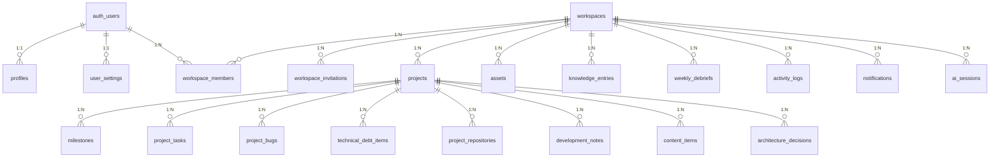

# Day Zero OS — Database Architecture Specification

**Version**: 1.0.0 Database Architecture  
**Status**: Formal Specification — Multi-Tenant Architecture Migration

---

## 1. Complete Entity Relationship (ER) Diagram



---

## 2. Table-by-Table Architectural Specification

### 2.1 Core Workspace Tables

#### `public.workspaces` (Modified)
- `id UUID PRIMARY KEY DEFAULT gen_random_uuid()`
- `owner_id UUID NOT NULL REFERENCES auth.users(id) ON DELETE CASCADE` (Fast Lookup Column)
- `name TEXT NOT NULL CHECK (length(trim(name)) > 0)`
- `slug TEXT NOT NULL UNIQUE`
- `is_personal BOOLEAN NOT NULL DEFAULT false`
- `logo_url TEXT`
- `storage_path TEXT`
- `metadata JSONB NOT NULL DEFAULT '{}'::jsonb`
- `deleted_at TIMESTAMPTZ`
- `created_at TIMESTAMPTZ NOT NULL DEFAULT now()`
- `updated_at TIMESTAMPTZ NOT NULL DEFAULT now()`

#### `public.workspace_members` (NEW)
- `id UUID PRIMARY KEY DEFAULT gen_random_uuid()`
- `workspace_id UUID NOT NULL REFERENCES public.workspaces(id) ON DELETE CASCADE`
- `user_id UUID NOT NULL REFERENCES auth.users(id) ON DELETE CASCADE`
- `role TEXT NOT NULL DEFAULT 'editor' CHECK (role IN ('owner', 'admin', 'editor', 'viewer'))`
- `status TEXT NOT NULL DEFAULT 'active' CHECK (status IN ('pending', 'active', 'suspended', 'removed'))`
- `joined_at TIMESTAMPTZ NOT NULL DEFAULT now()`
- `UNIQUE(workspace_id, user_id)`

#### `public.workspace_invitations` (NEW)
- `id UUID PRIMARY KEY DEFAULT gen_random_uuid()`
- `workspace_id UUID NOT NULL REFERENCES public.workspaces(id) ON DELETE CASCADE`
- `email TEXT NOT NULL`
- `role TEXT NOT NULL DEFAULT 'editor' CHECK (role IN ('admin', 'editor', 'viewer'))`
- `invited_by UUID NOT NULL REFERENCES auth.users(id) ON DELETE CASCADE`
- `token_hash TEXT UNIQUE NOT NULL`
- `status TEXT NOT NULL DEFAULT 'pending' CHECK (status IN ('pending', 'accepted', 'declined', 'expired', 'revoked'))`
- `expires_at TIMESTAMPTZ NOT NULL DEFAULT (now() + INTERVAL '7 days')`
- `created_at TIMESTAMPTZ NOT NULL DEFAULT now()`

---

## 3. Recommended Performance Indexes & Detailed Justification

To guarantee sub-50ms query responses under multi-tenant production loads, every new foreign key and query pattern has an explicit index:

```sql
-- 1. Workspace Membership Lookups
-- Purpose: Evaluated on EVERY RLS policy check and navigation event to fetch active workspace memberships.
CREATE INDEX idx_workspace_members_user_ws ON public.workspace_members(user_id, workspace_id) WHERE status = 'active';

-- 2. Workspace Invitation Token Verification
-- Purpose: Fast verification when an invitee clicks an email invite link.
CREATE INDEX idx_workspace_invitations_token_hash ON public.workspace_invitations(token_hash) WHERE status = 'pending';

-- 3. Workspace Slug Navigation
-- Purpose: Fast URL resolution when navigating to /w/:slug paths.
CREATE INDEX idx_workspaces_slug ON public.workspaces(slug);

-- 4. Projects per Workspace Filtering
-- Purpose: Speeds up project list rendering in Mission Control and Projects views.
CREATE INDEX idx_projects_ws_status ON public.projects(workspace_id, status) WHERE deleted_at IS NULL;

-- 5. Asset Vault Workspace Queries
-- Purpose: Speeds up file asset listings sorted by upload timestamp inside Asset Vault.
CREATE INDEX idx_assets_ws_created ON public.assets(workspace_id, created_at DESC);

-- 6. Knowledge Base Workspace Queries
-- Purpose: Speeds up note list rendering and tag filtering inside Knowledge Base.
CREATE INDEX idx_knowledge_ws_created ON public.knowledge_entries(workspace_id, created_at DESC);

-- 7. Weekly Debrief Workspace Queries
-- Purpose: Accelerates debrief lookup by workspace, user, and week start.
CREATE INDEX idx_weekly_debriefs_ws_user_week ON public.weekly_debriefs(workspace_id, user_id, week_start DESC);

-- 8. Activity Stream Feed
-- Purpose: Speeds up real-time activity feed rendering in Mission Control.
CREATE INDEX idx_activity_logs_ws_created ON public.activity_logs(workspace_id, created_at DESC);

-- 9. Notifications Workspace Filtering
-- Purpose: Speeds up fetching unread notifications for active user in current workspace.
CREATE INDEX idx_notifications_ws_user_read ON public.notifications(workspace_id, user_id, read_at);

-- 10. AI Sessions History
-- Purpose: Accelerates prompt history lookups for active workspace.
CREATE INDEX idx_ai_sessions_ws_created ON public.ai_sessions(workspace_id, created_at DESC);

-- 11. Task Assignment Lookups
-- Purpose: Speeds up "My Tasks" across projects for assigned team members.
CREATE INDEX idx_project_tasks_assigned ON public.project_tasks(assigned_to) WHERE status != 'done';
```
