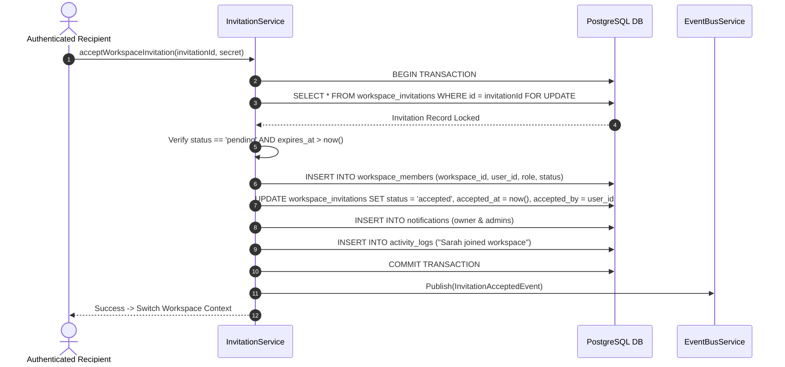

# Day Zero OS — Enterprise Team Invitation & Workspace Onboarding Architecture

**Document Version**: 4.0.0 (Production Master Architecture & Schema Refinements)  
**Date**: 2026-08-03  
**Status**: APPROVED ARCHITECTURE SPECIFICATION  
**Target Platform**: Day Zero OS Commercial SaaS (Notion / Linear / Slack Grade)

---

## 1. System Overview & Event Topology

The Day Zero OS Enterprise Invitation System utilizes a decoupled, event-driven service architecture. Operations on invitations emit domain events to an internal `EventBusService` (never exposed to React components), which routes notifications, updates billing seat counts, writes activity logs, and dispatches transactional emails via an abstract `EmailQueue`.

```mermaid
graph TD
    A[Workspace Admin / Owner] -->|Create / Resend Invite| B[WorkspaceInvitationService]
    B -->|Check Quotas & Rate Limits| C{Seat & Rate Limit Guard}
    C -->|Exceeded| D[Reject Request 429/402]
    C -->|Passed| E[Persist Invitation Record v+1]
    
    E --> F[Publish Domain Event]
    F --> G[EventBusService (Internal Service Layer Only)]
    
    G -->|Event: InvitationCreated/Resent| H[EmailQueueService]
    G -->|Event: InvitationAccepted/Declined| I[NotificationService]
    G -->|Event: Any State Transition| J[ActivityLogService]
    
    H -->|Retry Policy: 5m -> 30m -> 2h| K{EmailProvider Factory}
    K -->|Resend / SMTP / Edge / Console| L[Recipient Inbox]
```

---

## 2. PostgreSQL Native ENUM Types & Migration Conversion

To enforce strict database-level data integrity, PostgreSQL native `ENUM` types replace plain `TEXT` check constraints across all workspace tables.

### 2.1 Native ENUM Definitions
```sql
CREATE TYPE public.workspace_role AS ENUM ('owner', 'admin', 'editor', 'viewer');
CREATE TYPE public.workspace_member_status AS ENUM ('pending', 'active', 'suspended', 'removed');
CREATE TYPE public.workspace_invitation_status AS ENUM ('pending', 'accepted', 'declined', 'expired', 'cancelled', 'revoked');
CREATE TYPE public.workspace_invitation_type AS ENUM ('email', 'link', 'user', 'directory');
CREATE TYPE public.workspace_join_policy AS ENUM ('invite_only', 'open_link', 'domain_restricted', 'manual_approval');
```

### 2.2 Table Schema Conversions (`workspace_members` & `workspace_invitations`)
Columns `role`, `status`, and `invitation_type` are explicitly converted from `TEXT` to native `ENUM` types in `20260803000500_enterprise_invitation_refinements.sql` using:
```sql
ALTER TABLE public.workspace_members
  ALTER COLUMN role TYPE public.workspace_role USING role::public.workspace_role;
```

---

## 3. Cryptographic Secret Model & Versioning Rules

### 3.1 Secret Hashing & Encoding (`secret_hash`)
- **Raw Secret**: 256-bit random string generated in memory (`crypto.getRandomValues()`).
- **Encoding (`TEXT`)**: Hashed via SHA-256 and stored as a lower-case 64-character hex string (`secret_hash`).
- **Justification for `TEXT`**: Standard PostgREST parameter binding compatibility, clean JSON serialization, and index optimization without `BYTEA` conversion overhead.

### 3.2 Server-Side Hashing in `get_invitation_preview()`
The frontend URL passes the raw secret parameter (`?secret=<raw_secret>`). The frontend **NEVER** performs SHA-256 hashing client-side. Instead, `public.get_invitation_preview(id, secret)` hashes the secret server-side inside PostgreSQL:
```sql
computed_hash := encode(digest(p_secret, 'sha256'), 'hex');
```

### 3.3 Versioning & Rotation Rules
- Resending an invitation increments `version` (`version = version + 1`) and generates a new secret hash.
- **State Transition**: The older version transitions to `status = 'revoked'` (`cancelled_at = now()`), maintaining a complete, immutable audit trail. Old secret links immediately become invalid.

---

## 4. Partial Unique Index & Duplicate Protection

To guarantee that a workspace cannot accumulate duplicate pending invitations for the same email address:

```sql
CREATE UNIQUE INDEX idx_workspace_invitations_unique_pending_email
  ON public.workspace_invitations(workspace_id, email)
  WHERE status = 'pending';
```

If an admin invites an email address that already has a pending invitation, the backend intercepts the conflict and triggers the **Resend Flow** (incrementing version and rotating secret) instead of throwing an unhandled duplicate error.

---

## 5. Transactional Invitation Acceptance Flow

The acceptance process is fully transactional. No partial joins or ghost states can occur:



---

## 6. Retention & Cleanup Policy

- **Active / Pending Invitations**: Retained indefinitely until accepted, declined, or revoked.
- **Historical Audit Logs**: Retained in `workspace_invitations` table.
- **90-Day Purge Cron**: A scheduled background worker (or Supabase pg_cron) archives/deletes `expired` or `revoked` invitations older than 90 days:
```sql
DELETE FROM public.workspace_invitations
WHERE status IN ('expired', 'revoked')
  AND updated_at < (now() - INTERVAL '90 days');
```

---

## 7. Migration 5 Specification (`20260803000500_enterprise_invitation_refinements.sql`)

```sql
BEGIN;

CREATE EXTENSION IF NOT EXISTS pgcrypto;

-- 1. Create Native PostgreSQL ENUM Types
DO $$ BEGIN
  CREATE TYPE public.workspace_role AS ENUM ('owner', 'admin', 'editor', 'viewer');
EXCEPTION WHEN duplicate_object THEN NULL; END $$;

DO $$ BEGIN
  CREATE TYPE public.workspace_member_status AS ENUM ('pending', 'active', 'suspended', 'removed');
EXCEPTION WHEN duplicate_object THEN NULL; END $$;

DO $$ BEGIN
  CREATE TYPE public.workspace_invitation_status AS ENUM ('pending', 'accepted', 'declined', 'expired', 'cancelled', 'revoked');
EXCEPTION WHEN duplicate_object THEN NULL; END $$;

DO $$ BEGIN
  CREATE TYPE public.workspace_invitation_type AS ENUM ('email', 'link', 'user', 'directory');
EXCEPTION WHEN duplicate_object THEN NULL; END $$;

DO $$ BEGIN
  CREATE TYPE public.workspace_join_policy AS ENUM ('invite_only', 'open_link', 'domain_restricted', 'manual_approval');
EXCEPTION WHEN duplicate_object THEN NULL; END $$;

-- 2. Add New Columns
ALTER TABLE public.workspace_invitations
  ADD COLUMN IF NOT EXISTS invitation_type TEXT NOT NULL DEFAULT 'email',
  ADD COLUMN IF NOT EXISTS version INT NOT NULL DEFAULT 1,
  ADD COLUMN IF NOT EXISTS secret_hash TEXT,
  ADD COLUMN IF NOT EXISTS accepted_ip INET,
  ADD COLUMN IF NOT EXISTS accepted_device TEXT,
  ADD COLUMN IF NOT EXISTS accepted_browser TEXT,
  ADD COLUMN IF NOT EXISTS accepted_at TIMESTAMPTZ,
  ADD COLUMN IF NOT EXISTS accepted_by UUID REFERENCES auth.users(id) ON DELETE SET NULL,
  ADD COLUMN IF NOT EXISTS declined_at TIMESTAMPTZ,
  ADD COLUMN IF NOT EXISTS declined_by UUID REFERENCES auth.users(id) ON DELETE SET NULL,
  ADD COLUMN IF NOT EXISTS cancelled_at TIMESTAMPTZ,
  ADD COLUMN IF NOT EXISTS cancelled_by UUID REFERENCES auth.users(id) ON DELETE SET NULL,
  ADD COLUMN IF NOT EXISTS last_sent_at TIMESTAMPTZ DEFAULT now(),
  ADD COLUMN IF NOT EXISTS resend_count INT NOT NULL DEFAULT 0,
  ADD COLUMN IF NOT EXISTS updated_at TIMESTAMPTZ DEFAULT now();

-- 3. Safely Convert Existing Columns to Native ENUM Types
ALTER TABLE public.workspace_members DROP CONSTRAINT IF EXISTS workspace_members_role_check;
ALTER TABLE public.workspace_members DROP CONSTRAINT IF EXISTS workspace_members_status_check;
ALTER TABLE public.workspace_invitations DROP CONSTRAINT IF EXISTS workspace_invitations_role_check;
ALTER TABLE public.workspace_invitations DROP CONSTRAINT IF EXISTS workspace_invitations_status_check;
ALTER TABLE public.workspace_invitations DROP CONSTRAINT IF EXISTS workspace_invitations_invitation_type_check;

ALTER TABLE public.workspace_members
  ALTER COLUMN role DROP DEFAULT,
  ALTER COLUMN role TYPE public.workspace_role USING role::public.workspace_role,
  ALTER COLUMN role SET DEFAULT 'editor'::public.workspace_role;

ALTER TABLE public.workspace_members
  ALTER COLUMN status DROP DEFAULT,
  ALTER COLUMN status TYPE public.workspace_member_status USING status::public.workspace_member_status,
  ALTER COLUMN status SET DEFAULT 'active'::public.workspace_member_status;

ALTER TABLE public.workspace_invitations
  ALTER COLUMN role DROP DEFAULT,
  ALTER COLUMN role TYPE public.workspace_role USING role::public.workspace_role,
  ALTER COLUMN role SET DEFAULT 'editor'::public.workspace_role;

ALTER TABLE public.workspace_invitations
  ALTER COLUMN status DROP DEFAULT,
  ALTER COLUMN status TYPE public.workspace_invitation_status USING status::public.workspace_invitation_status,
  ALTER COLUMN status SET DEFAULT 'pending'::public.workspace_invitation_status;

ALTER TABLE public.workspace_invitations
  ALTER COLUMN invitation_type DROP DEFAULT,
  ALTER COLUMN invitation_type TYPE public.workspace_invitation_type USING invitation_type::public.workspace_invitation_type,
  ALTER COLUMN invitation_type SET DEFAULT 'email'::public.workspace_invitation_type;

-- 4. Create Partial Unique Index
CREATE UNIQUE INDEX IF NOT EXISTS idx_workspace_invitations_unique_pending_email
  ON public.workspace_invitations(workspace_id, email)
  WHERE status = 'pending';

-- 5. Create Composite Indexes
CREATE INDEX IF NOT EXISTS idx_workspace_invitations_id_version_secret
  ON public.workspace_invitations(id, version, secret_hash)
  WHERE status = 'pending';

-- 6. Server-Hashed Pre-Auth Verification RPC Function (get_invitation_preview)
CREATE OR REPLACE FUNCTION public.get_invitation_preview(p_invitation_id UUID, p_secret TEXT)
RETURNS TABLE (
  invitation_id UUID,
  workspace_id UUID,
  workspace_name TEXT,
  workspace_logo TEXT,
  inviter_name TEXT,
  email TEXT,
  role TEXT,
  status TEXT,
  version INT,
  expires_at TIMESTAMPTZ,
  is_expired BOOLEAN
) AS $$
DECLARE
  computed_hash TEXT;
BEGIN
  computed_hash := encode(digest(p_secret, 'sha256'), 'hex');

  RETURN QUERY
  SELECT
    i.id,
    w.id,
    w.name,
    w.logo_url,
    COALESCE(p.full_name, 'A team member'),
    i.email,
    i.role::text,
    i.status::text,
    i.version,
    i.expires_at,
    (i.expires_at < now()) AS is_expired
  FROM public.workspace_invitations i
  JOIN public.workspaces w ON w.id = i.workspace_id
  LEFT JOIN public.profiles p ON p.id = i.invited_by
  WHERE i.id = p_invitation_id
    AND (i.secret_hash = computed_hash OR i.token_hash = computed_hash);
END;
$$ LANGUAGE plpgsql SECURITY DEFINER SET search_path = public, pg_temp STABLE;

NOTIFY pgrst, 'reload schema';

COMMIT;
```

---

### Awaiting Final Approval to Begin Phase 2 Implementation
