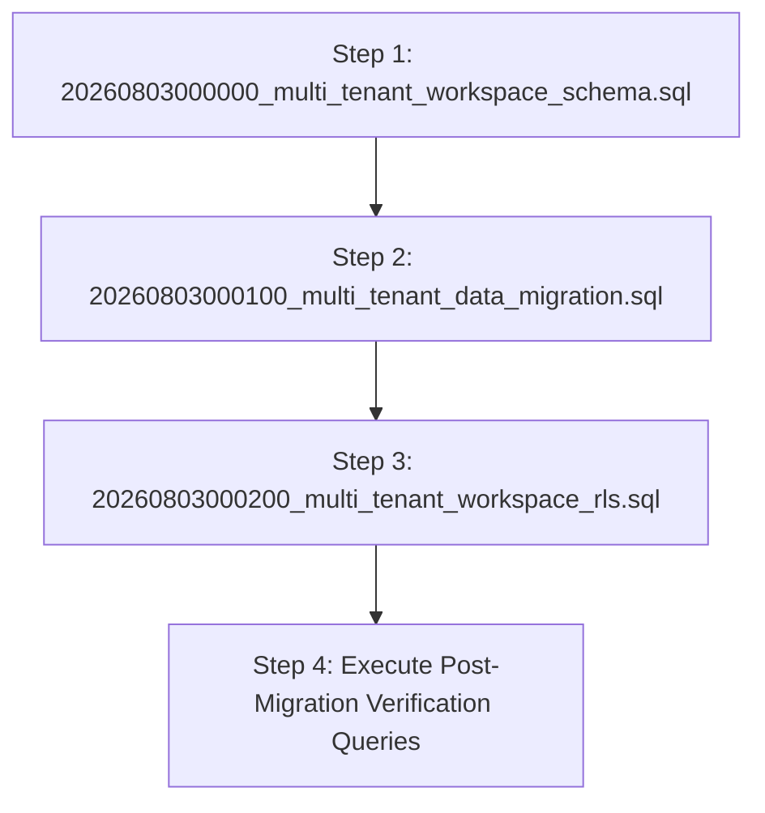

# Day Zero OS — Multi-Tenant Migration Guide & Production Readiness Checklist

**Version**: 1.0.0 Migration Specification  
**Status**: Formal Guide — Multi-Tenant Architecture Migration

---

## 1. Production Migration Execution Sequence & Rationale

Database migrations MUST be executed in the exact 4-step sequence below:



### Why This Sequence Is Strictly Required:
1. **Step 1 (Schema Migration)**: Tables (`workspace_members`, `workspace_invitations`), foreign key columns (`workspace_id`), branding fields, and indexes MUST exist in the schema before data backfilling can occur.
2. **Step 2 (Data Migration)**: Existing user data MUST be backfilled into Personal Workspaces BEFORE Row Level Security (RLS) policies are enabled. If RLS were enabled before data backfill, PostgreSQL RLS policies would immediately block and hide all existing records because `workspace_id` would still be `NULL`.
3. **Step 3 (RLS Policies & Helpers)**: SECURITY DEFINER helper functions (`is_workspace_member()`, `get_workspace_role()`) and workspace-scoped RLS policies are enabled ONLY AFTER 100% of data has a valid `workspace_id`.
4. **Step 4 (Verification Queries)**: Confirms zero orphan records and verifies profile workspace integrity.

---

## 2. Production Safety Checklist

Before executing SQL migrations on a production Supabase instance, complete every item in this checklist:

```markdown
### Production Migration Checklist

- [ ] **1. Backup Production Database**: Create a manual point-in-time backup in Supabase Dashboard (Database -> Backups -> Create Backup).
- [ ] **2. Export Current Schema**: Export current SQL schema via Supabase CLI (`supabase db dump`) or Dashboard.
- [ ] **3. Verify Staging Execution**: Execute SQL migrations on a staging or duplicate project first to confirm clean execution without errors.
- [ ] **4. Execute Step 1 (Schema SQL)**: Execute `20260803000000_multi_tenant_workspace_schema.sql` inside Supabase SQL Editor within a `BEGIN; ... COMMIT;` transaction block.
- [ ] **5. Execute Step 2 (Data Migration SQL)**: Execute `20260803000100_multi_tenant_data_migration.sql` to run `public.migrate_existing_data_to_workspaces()`.
- [ ] **6. Run Verification Queries**: Verify zero orphan records (`SELECT count(*) FROM projects WHERE workspace_id IS NULL`).
- [ ] **7. Execute Step 3 (RLS Policies SQL)**: Execute `20260803000200_multi_tenant_workspace_rls.sql` to enable RLS security helpers and workspace policies.
- [ ] **8. Verify RLS Enforcement**: Confirm multi-tenant data isolation using test user accounts.
- [ ] **9. Verify Authentication & Password Reset**: Test sign in, sign up, and password reset workflows.
- [ ] **10. Verify Workspace Switching**: Verify workspace switcher UI transitions between Personal and Team workspaces seamlessly.
```

---

## 3. Idempotent Data Migration Function

```sql
CREATE OR REPLACE FUNCTION public.migrate_existing_data_to_workspaces()
RETURNS VOID AS $$
DECLARE
  u RECORD;
  ws_id UUID;
BEGIN
  -- 1. Ensure every user has a Personal Workspace and owner membership
  FOR u IN SELECT id, email, raw_user_meta_data FROM auth.users LOOP
    SELECT id INTO ws_id FROM public.workspaces WHERE owner_id = u.id AND is_personal = true LIMIT 1;

    IF ws_id IS NULL THEN
      INSERT INTO public.workspaces (owner_id, name, slug, is_personal)
      VALUES (
        u.id,
        COALESCE(u.raw_user_meta_data->>'workspace_name', 'Personal Workspace'),
        lower(replace(split_part(u.email, '@', 1), '.', '-')) || '-personal',
        true
      )
      RETURNING id INTO ws_id;
    END IF;

    -- Ensure owner member record exists
    INSERT INTO public.workspace_members (workspace_id, user_id, role, status)
    VALUES (ws_id, u.id, 'owner', 'active')
    ON CONFLICT (workspace_id, user_id) DO NOTHING;

    -- Backfill orphan records for this user
    UPDATE public.projects SET workspace_id = ws_id WHERE owner_id = u.id AND workspace_id IS NULL;
    UPDATE public.assets SET workspace_id = ws_id WHERE owner_id = u.id AND workspace_id IS NULL;
    UPDATE public.knowledge_entries SET workspace_id = ws_id WHERE owner_id = u.id AND workspace_id IS NULL;
    UPDATE public.weekly_debriefs SET workspace_id = ws_id WHERE user_id = u.id AND workspace_id IS NULL;
    UPDATE public.activity_logs SET workspace_id = ws_id WHERE user_id = u.id AND workspace_id IS NULL;
    UPDATE public.notifications SET workspace_id = ws_id WHERE user_id = u.id AND workspace_id IS NULL;
    UPDATE public.ai_sessions SET workspace_id = ws_id WHERE user_id = u.id AND workspace_id IS NULL;
  END LOOP;
END;
$$ LANGUAGE plpgsql SECURITY DEFINER;
```

---

## 4. Verification Queries

```sql
-- Verify zero orphan records
SELECT count(*) AS orphan_projects FROM public.projects WHERE workspace_id IS NULL;
SELECT count(*) AS orphan_assets FROM public.assets WHERE workspace_id IS NULL;
SELECT count(*) AS orphan_knowledge FROM public.knowledge_entries WHERE workspace_id IS NULL;
SELECT count(*) AS orphan_debriefs FROM public.weekly_debriefs WHERE workspace_id IS NULL;
SELECT count(*) AS orphan_logs FROM public.activity_logs WHERE workspace_id IS NULL;
SELECT count(*) AS orphan_notifications FROM public.notifications WHERE workspace_id IS NULL;
SELECT count(*) AS orphan_ai_sessions FROM public.ai_sessions WHERE workspace_id IS NULL;
```
