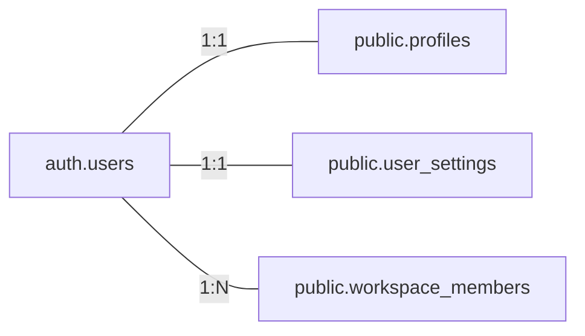
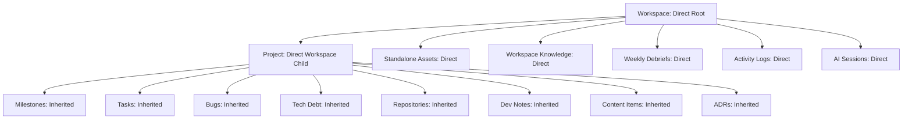

# Day Zero OS — SaaS Architecture Master Overview

**Version**: 1.0.0 Master System Architecture  
**Audience**: Developers, System Architects & Maintainers  
**Status**: Formal Reference Architecture — Multi-Tenant Workspace Operating System

---

## 1. Executive Summary & Core System Purpose

Day Zero OS is a multi-tenant, project-centric digital operating system for software engineers, creators, startup founders, and builders. It connects every phase of building products—ideas, research, specs, tasks, milestones, bugs, code repositories, asset management, content generation, and weekly reflections—into a single collaborative workspace.

---

## 2. Authentication & User Identity

- **Authentication Service**: Managed via Supabase Auth (`auth.users`).
- **User Identity**: Every individual builder registers their own unique account with their own email credentials or OAuth provider.
- **Profiles Table (`public.profiles`)**: A 1:1 extension of `auth.users`, storing `full_name`, `username`, `avatar_url`, and `timezone`.
- **User Preferences Store (`public.user_settings`)**: Centralized per-user preference table storing `current_workspace_id`, `theme`, `accent_color`, `language`, `timezone`, `date_format`, `time_format`, and `notifications`.



---

## 3. Workspace Model & Tenant Architecture

Workspaces are the root multi-tenant isolation boundaries in Day Zero OS.

### Personal vs. Team Workspaces:
- **Personal Workspace**: Auto-created for every user on signup (`is_personal = true`). Cannot be deleted, cannot transfer ownership, and user cannot leave. Acts as the mandatory fallback workspace.
- **Team Workspace**: Multi-user workspace created on-demand. Managed by a primary Owner who can invite members, assign RBAC roles, transfer ownership, or delete the workspace.

### Current Workspace Resolution Priority:
When a user accesses Day Zero OS, the system resolves the active workspace deterministically:
1. **Priority 1**: URL Parameter (`?ws=workspace_id` or `/w/:slug`)
2. **Priority 2**: `localStorage` cached ID (`day_zero_os_active_workspace_id`)
3. **Priority 3**: `user_settings.current_workspace_id`
4. **Priority 4**: Personal Workspace Fallback

---

## 4. Ownership Model & DIRECT vs. INHERITED Rule

To prevent schema redundancy, database entities follow strict ownership scoping rules:



### Scoping Matrix:
- **DIRECT Workspace Ownership**: `workspaces`, `workspace_members`, `workspace_invitations`, `projects`, standalone `assets`, standalone `knowledge_entries`, `weekly_debriefs`, `activity_logs`, `notifications`, `ai_sessions`.
- **INHERITED Workspace Ownership**: `milestones`, `project_tasks`, `project_bugs`, `technical_debt_items`, `project_repositories`, `development_notes`, `content_items`, `architecture_decisions`. Inherited via `project_id -> projects.workspace_id`.

### Project Creator Attribution:
In `public.projects`, `owner_id` represents the **creator** of the project (`created_by`), serving as permanent author attribution. Project management authority is determined by workspace role (`owner`, `admin`, `editor`).

---

## 5. Permission & Security Model (RBAC & RLS)

All security is enforced at the database level using PostgreSQL Row Level Security (RLS) and reusable `SECURITY DEFINER` SQL helper functions:
- `public.is_workspace_member(workspace_id)`
- `public.get_workspace_role(workspace_id)`
- `public.can_manage_workspace(workspace_id)`
- `public.is_project_workspace_member(project_id)`
- `public.can_edit_project(project_id)`

### Workspace Roles:
- **`owner`**: Full administrative, billing, and ownership transfer authority.
- **`admin`**: Manage members, invite users, manage workspace branding, edit all projects.
- **`editor`**: Create and edit projects, tasks, milestones, assets, and knowledge entries.
- **`viewer`**: Read-only access to workspace projects, tasks, and assets.

---

## 6. Activity & Notification Models

### Activity Model:
- **Workspace Activity**: High-level tenant events (`member_joined`, `member_removed`, `workspace_renamed`, `invitation_accepted`, `workspace_settings_updated`, `standalone_asset_uploaded`).
- **Project Activity**: Execution events (`task_created`, `task_completed`, `milestone_created`, `milestone_completed`, `bug_reported`, `bug_closed`, `tech_debt_resolved`, `repo_attached`).

### Notification Lifecycle:
Notifications support a 4-stage state machine:
`Unread` (`read_at IS NULL`) $\rightarrow$ `Read` (`read_at = now()`) $\rightarrow$ `Archived` (`archived_at = now()`) $\rightarrow$ `Deleted` (`deleted_at = now()`).

---

## 7. Search Model & Scope Hierarchy

Day Zero OS implements a 3-tier search scope hierarchy:
1. **Global Search**: Search across all workspaces user belongs to.
2. **Workspace Search** *(Current Release Default)*: Search strictly inside the active workspace (`workspace_id`).
3. **Project Search**: Search scoped to a single project within the active workspace.

---

## 8. AI Ownership & Session Model

AI Assistant sessions belong directly to a **Workspace** (`workspace_id`), are attributed to the user who started the session (`user_id`), and can optionally be linked to a specific **Project** (`project_id`). This preserves shared workspace prompt history while maintaining author attribution.

---

## 9. Storage Structure Layout

Supabase Storage buckets follow a structured hierarchy to prevent asset collisions:

```text
assets/
  ├── {workspace_id}/
  │   ├── standalone/
  │   │   └── {filename}.ext
  │   └── {project_id}/
  │       └── {filename}.ext

workspace-logos/
  └── {workspace_id}/
      └── logo.png

avatars/
  └── {user_id}/
      └── avatar.png
```

---

## 10. Future Extensibility Roadmap

The database architecture is designed to support the following future features without database redesigns:
- **Optional Project-Level Permissions**: Future `project_members` table allowing granular project leads and reviewers.
- **Workspace Billing**: Schema placeholders for Stripe Customer ID and subscription tiers.
- **Workspace API Keys & Webhooks**: Future `workspace_api_keys` and `workspace_webhooks` tables.
