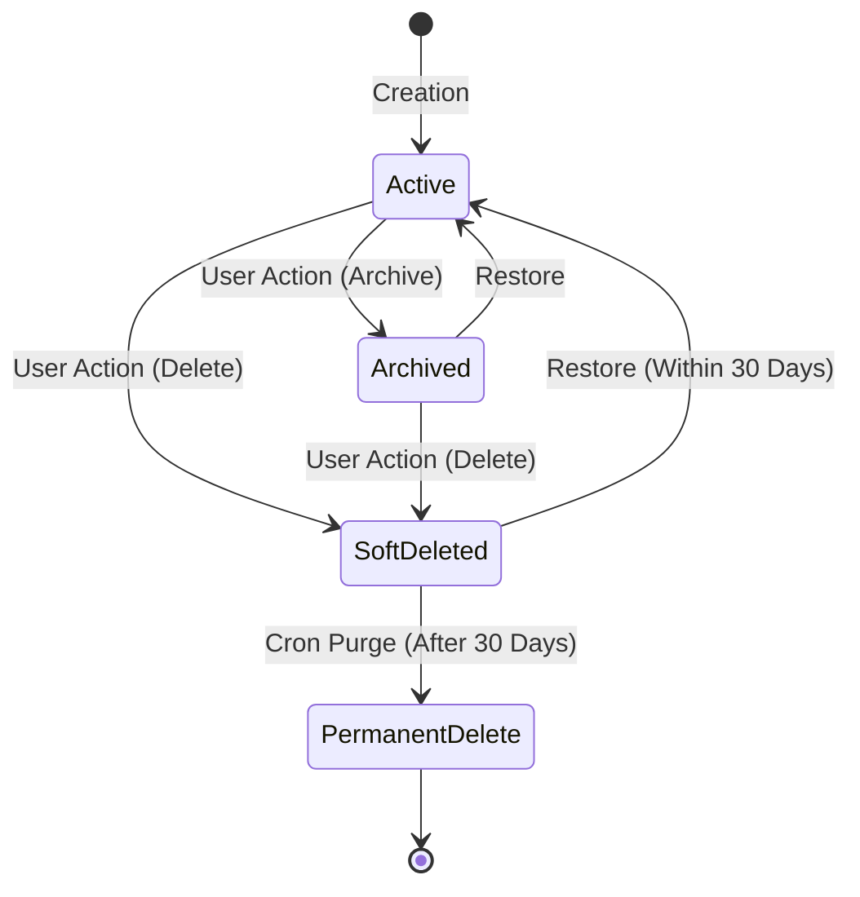

# Day Zero OS — Workspace Model Specification

**Version**: 1.0.0 Architecture Specification  
**Status**: Formal Specification — Multi-Tenant Architecture Migration

---

## 1. Overview & Core Principles

The Workspace is the primary tenant boundary in Day Zero OS. All data—including projects, tasks, milestones, bugs, assets, notes, knowledge entries, debriefs, activity, notifications, and AI sessions—belongs to a Workspace.

---

## 2. Workspace Ownership Consistency Rule

To ensure performance for fast lookups while maintaining permission integrity:
- **Fast Lookups**: `workspaces.owner_id` is maintained for quick ownership checks and backward compatibility.
- **Source of Truth**: The `workspace_members` table is the **authoritative source of truth** for all permission checks via `role = 'owner'`.
- **Consistency Invariant**: `workspaces.owner_id` MUST always match the `user_id` of the single `workspace_members` record where `role = 'owner'`.

### Ownership Transfer Transaction:
Ownership transfer is executed as an atomic SQL transaction updating **BOTH** tables simultaneously so they never diverge:

```sql
CREATE OR REPLACE FUNCTION public.transfer_workspace_ownership(target_workspace_id UUID, new_owner_id UUID)
RETURNS VOID AS $$
DECLARE
  current_owner_id UUID;
BEGIN
  -- 1. Check execution authority (must be called by current workspace owner)
  SELECT owner_id INTO current_owner_id FROM public.workspaces WHERE id = target_workspace_id;
  IF current_owner_id IS NULL OR current_owner_id != auth.uid() THEN
    RAISE EXCEPTION 'Only the current workspace owner can transfer ownership.';
  END IF;

  -- 2. Verify new owner is an active member of the workspace
  IF NOT EXISTS (SELECT 1 FROM public.workspace_members WHERE workspace_id = target_workspace_id AND user_id = new_owner_id AND status = 'active') THEN
    RAISE EXCEPTION 'Target owner must be an active member of this workspace.';
  END IF;

  -- 3. Atomic Dual Update
  -- Update new owner role
  UPDATE public.workspace_members SET role = 'owner' WHERE workspace_id = target_workspace_id AND user_id = new_owner_id;
  -- Demote previous owner to admin
  UPDATE public.workspace_members SET role = 'admin' WHERE workspace_id = target_workspace_id AND user_id = current_owner_id;
  -- Update workspace table fast-lookup column
  UPDATE public.workspaces SET owner_id = new_owner_id, updated_at = now() WHERE id = target_workspace_id;
END;
$$ LANGUAGE plpgsql SECURITY DEFINER;
```

---

## 3. Personal Workspace vs. Team Workspace Rules

| Property / Rule | Personal Workspace | Team Workspace |
| :--- | :--- | :--- |
| **Creation** | Auto-created for every user on signup via `handle_new_user()` database trigger. | Created on-demand by any authenticated user via UI or API. |
| **Naming** | `${User.name}'s Workspace` or `Personal Workspace`. | Custom workspace name chosen by creator. |
| **Marker Column** | `is_personal = true` | `is_personal = false` |
| **Ownership** | User is immutable Owner. Ownership **cannot be transferred**. | Has exactly one primary Owner. Ownership **can be transferred**. |
| **Deletion Policy** | **Cannot be deleted** (permanent tenant). | Owner can archive, soft-delete, or hard-delete. |
| **Member Leaving** | Owner **cannot leave** their Personal Workspace. | Members can leave freely. Owner cannot leave until transferring ownership. |
| **Member Limit** | Single-user only (no invited members). | Multi-user team workspace. |
| **Fallback Status** | Default system fallback workspace if removed from team workspaces. | Secondary workspace. |

---

## 4. Workspace Lifecycle & Soft Delete Strategy

Both Workspaces and Projects follow a strict 5-stage lifecycle state machine to prevent accidental data loss:



### Lifecycle Stage Definitions:
1. **Active**: Fully functional and operational state.
2. **Archived**: Read-only state (`status = 'archived'`). Hidden from active workspace pickers unless "Include Archived" is toggled.
3. **Soft Deleted**: Soft-deleted state (`deleted_at = now()`). Retained in database for 30 days. All queries default to filtering out `deleted_at IS NOT NULL`.
4. **Retention Period (30 Days)**: Users can restore soft-deleted workspaces or projects within 30 days.
5. **Permanent Delete**: Triggered automatically by a scheduled cleanup function after 30 days or manually confirmed by Workspace Owner. Cascades deletion to child entities and S3/Storage bucket objects.

---

## 5. Centralized User Preference Store (`user_settings`)

The `user_settings` table acts as the user's centralized preference store across all devices:

```sql
CREATE TABLE public.user_settings (
  user_id UUID PRIMARY KEY REFERENCES auth.users(id) ON DELETE CASCADE,
  current_workspace_id UUID REFERENCES public.workspaces(id) ON DELETE SET NULL,
  theme TEXT NOT NULL DEFAULT 'light' CHECK (theme IN ('dark', 'light', 'system')),
  accent_color TEXT NOT NULL DEFAULT '#3b82f6',
  sidebar_layout TEXT NOT NULL DEFAULT 'standard',
  default_project_view TEXT NOT NULL DEFAULT 'board',
  notifications JSONB NOT NULL DEFAULT '{"email": true, "push": false}'::jsonb,
  ai_enabled BOOLEAN NOT NULL DEFAULT false,
  ai_provider public.ai_provider,
  language TEXT NOT NULL DEFAULT 'en',
  timezone TEXT NOT NULL DEFAULT 'UTC',
  date_format TEXT NOT NULL DEFAULT 'MMM D, YYYY',
  time_format TEXT NOT NULL DEFAULT '12h',
  preferences JSONB NOT NULL DEFAULT '{}'::jsonb,
  updated_at TIMESTAMPTZ NOT NULL DEFAULT now()
);
```

---

## 6. Current Workspace Resolution Order

When a user opens Day Zero OS, the active workspace is resolved using a strict 4-level deterministic priority fallback:

1. **Priority 1: URL Parameter** (`?ws=workspace_id` or `/w/:slug`) — Evaluated first if user navigates via a deep-link. Validates workspace membership before activating.
2. **Priority 2: `localStorage` Cache** (`localStorage.getItem('day_zero_os_active_workspace_id')`) — Provides instant client-side startup before network request completes.
3. **Priority 3: `user_settings.current_workspace_id`** — Server-persisted workspace preference from Supabase user settings.
4. **Priority 4: Personal Workspace Fallback** — Guarantees fallback to the user's Personal Workspace if all prior options fail or if membership was revoked.

---

## 7. Invitation Lifecycle & Security Model

Invitations use **secure, hashed, one-time tokens** to prevent token theft or replay attacks.

### Invitation Security Rules:
- **Token Generation**: High-entropy 32-byte cryptographic random string: `crypto.randomBytes(32).toString('hex')`.
- **Token Storage**: Raw token is NEVER stored in the database. Database stores `token_hash = digest(raw_token, 'sha256')`.
- **Expiration**: Standard 7-day expiration (`expires_at = now() + INTERVAL '7 days'`).
- **One-Time Acceptance**: Upon acceptance, `status` changes to `'accepted'` and `accepted_at` is timestamped. Reuse attempts fail immediately.
- **Revocation**: Admins can revoke invites at any time, setting `status = 'revoked'`.

---

## 8. Member Lifecycle (Separation of Role & Status)

- **Roles**: `owner`, `admin`, `editor`, `viewer`
- **Status**: `pending`, `active`, `suspended`, `removed`

---

## 9. Workspace Slug Collision Handling

1. Base slug: `base_slug = lower(regexp_replace(trim(name), '[^a-zA-Z0-9]+', '-', 'g'))`.
2. If `base_slug` exists, append a random 4-character hex suffix: `base_slug + '-' + encode(gen_random_bytes(2), 'hex')` (e.g. `tech-titans-a84d`).

---

## 10. Workspace Branding & Metadata

- Explicit logo columns: `logo_url TEXT`, `storage_path TEXT`.
- Extensible settings stored in `metadata JSONB NOT NULL DEFAULT '{}'::jsonb`.
